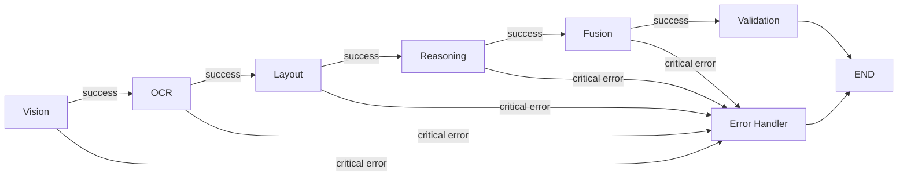

# Technical Report: Multi-Modal Document Intelligence Platform

## Executive Summary

This document presents the architecture, design decisions, and implementation details of a **production-ready Multi-Modal Document Intelligence Platform**. The system leverages a 6-agent LangGraph pipeline for document processing, multi-modal RAG for intelligent querying, and a premium React frontend for human interaction.

---

## 1. Architecture Overview

### 1.1 High-Level Architecture

```
┌─────────────────────────────────────────────────────────────────────────────┐
│                              Frontend (React + Vite)                         │
├─────────────────────────────────────────────────────────────────────────────┤
│   DocumentUpload │ DocumentViewer │ ChatInterface │ ReviewPanel             │
└────────────────────────────────┬────────────────────────────────────────────┘
                                 │ HTTP/WebSocket
                                 ▼
┌─────────────────────────────────────────────────────────────────────────────┐
│                           FastAPI Backend                                    │
├─────────────────────────────────────────────────────────────────────────────┤
│   /api/documents  │  /api/chat  │  /api/review  │  /ws                      │
└────────────────────────────────┬────────────────────────────────────────────┘
                                 │
                                 ▼
┌─────────────────────────────────────────────────────────────────────────────┐
│                       LangGraph 6-Agent Pipeline                             │
├─────────────────────────────────────────────────────────────────────────────┤
│  Vision → OCR → Layout → Text Reasoning → Fusion → Validation               │
└────────────────────────────────┬────────────────────────────────────────────┘
                                 │
                                 ▼
┌─────────────────────────────────────────────────────────────────────────────┐
│                       Multi-Modal RAG System                                 │
├─────────────────────────────────────────────────────────────────────────────┤
│  TextEmbedder │ ImageEmbedder │ TableEmbedder │ CrossModalRetriever         │
└────────────────────────────────┬────────────────────────────────────────────┘
                                 │
                                 ▼
┌─────────────────────────────────────────────────────────────────────────────┐
│                           Qdrant Vector Database                             │
├─────────────────────────────────────────────────────────────────────────────┤
│     documents_text     │    documents_tables    │    documents_images        │
└─────────────────────────────────────────────────────────────────────────────┘
```

### 1.2 Technology Stack

| Layer | Technology | Rationale |
|-------|------------|-----------|
| **Frontend** | React 18 + Vite | Fast development, modern DX |
| **Backend** | FastAPI | Async, typed, auto-documentation |
| **Agent Framework** | LangGraph | Explicit state management, graph-based |
| **Computer Vision** | YOLO + OpenCV | SOTA detection + fallback |
| **OCR** | Tesseract + EasyOCR | Primary + fallback strategy |
| **LLM** | OpenAI/Anthropic | Flexible provider support |
| **Vector DB** | Qdrant | Multi-collection, efficient similarity |
| **Text Embeddings** | SentenceTransformers | all-MiniLM-L6-v2 (384 dim) |
| **Image Embeddings** | CLIP | Cross-modal capability |

---

## 2. 6-Agent LangGraph Pipeline

### 2.1 Agent Architecture

Each agent follows a consistent pattern:

```python
class Agent:
    def __init__(self, config):
        self.config = config
    
    def __call__(self, state: DocumentState) -> DocumentState:
        # Process state
        # Update state
        return state
```

### 2.2 Agent Descriptions

#### Vision Agent
- **Purpose**: Detect document layout elements
- **Input**: Page images
- **Output**: Bounding boxes with labels (table, figure, chart, signature)
- **Technology**: YOLO (primary) + OpenCV morphological operations (fallback)
- **Key Features**:
  - Table detection via line detection
  - Figure detection via contour analysis
  - NMS for overlapping removal

#### OCR Agent
- **Purpose**: Extract text from document regions
- **Input**: Images + detected regions
- **Output**: Text blocks with coordinates and confidence
- **Technology**: Tesseract (primary) + EasyOCR (fallback)
- **Key Features**:
  - Hybrid approach with automatic fallback
  - Confidence-based engine selection
  - Region-specific extraction

#### Layout Agent
- **Purpose**: Analyze spatial relationships
- **Input**: OCR text blocks + Vision detections
- **Output**: Document structure graph
- **Technology**: Custom spatial analysis
- **Key Features**:
  - Reading order determination
  - Paragraph grouping
  - Column detection

#### Text Reasoning Agent
- **Purpose**: Semantic understanding
- **Input**: Extracted text + layout
- **Output**: Summary, entities, key facts
- **Technology**: LLM (OpenAI/Anthropic)
- **Key Features**:
  - Document summarization
  - Entity extraction
  - Key point identification

#### Fusion Agent
- **Purpose**: Merge multi-modal outputs
- **Input**: All previous agent outputs
- **Output**: Unified JSON representation
- **Technology**: Rule-based + confidence scoring
- **Key Features**:
  - Cross-reference text and vision
  - Conflict resolution
  - Table structure normalization

#### Validation Agent
- **Purpose**: Quality assurance
- **Input**: Fused output
- **Output**: Confidence scores + review flags
- **Technology**: Custom validation logic
- **Key Features**:
  - Field-level confidence
  - Modality agreement scoring
  - Human review flagging

### 2.3 State Transitions



---

## 3. Multi-Modal RAG System

### 3.1 Embedding Strategy

| Modality | Model | Dimension | Collection |
|----------|-------|-----------|------------|
| Text | all-MiniLM-L6-v2 | 384 | documents_text |
| Images | CLIP ViT-B/32 | 512 | documents_images |
| Tables | Custom (text-based) | 384 | documents_tables |

### 3.2 Table Embedding Approach

Tables are embedded using a semantic representation:

```python
def embed_table(table):
    parts = []
    parts.append("Headers: " + ", ".join(headers))
    for row in rows[:3]:
        parts.append(f"Row: " + " | ".join(row))
    parts.append(f"Table with {n_rows} rows, {n_cols} columns")
    return text_embedder.embed("\n".join(parts))
```

### 3.3 Cross-Modal Retrieval

The system supports queries like:
- "Explain the diagram on page 4" → Image retrieval
- "What does the revenue table show?" → Table retrieval
- "Summarize the document" → Text retrieval

### 3.4 Reciprocal Rank Fusion

Results from different modalities are merged using RRF:

```
RRF_score = Σ 1/(k + rank_i)
```

Where k=60 (standard constant).

---

## 4. ELI5 vs Expert Mode

### 4.1 Implementation

The WOW feature provides two explanation levels:

**ELI5 Mode:**
```
You are a friendly teacher explaining documents to someone with no prior knowledge.
Use simple words, analogies, and everyday examples.
```

**Expert Mode:**
```
You are a senior analyst providing expert-level document analysis.
Use precise technical terminology and cite specific data points.
```

### 4.2 Side-by-Side Comparison

The `/api/chat/{id}/explain` endpoint returns both modes:

```json
{
  "query": "Explain the revenue trend",
  "eli5": "Imagine you have a lemonade stand...",
  "expert": "The YoY revenue CAGR of 15.3% indicates..."
}
```

---

## 5. Human Review System

### 5.1 Confidence Scoring

Each extracted field receives a confidence score:

```python
confidence = (ocr_confidence * 0.4 + 
              vision_confidence * 0.3 + 
              cross_modal_agreement * 0.3)
```

### 5.2 Flag Thresholds

| Threshold | Action |
|-----------|--------|
| < 0.6 | Low confidence warning |
| < 0.7 | Human review required |
| >= 0.7 | Auto-accepted |

### 5.3 Review Workflow

1. System flags low-confidence extractions
2. Reviewer sees highlighted document view
3. Options: Confirm / Correct / Reject
4. Corrections stored for feedback loop

---

## 6. API Design

### 6.1 Endpoints

| Endpoint | Method | Description |
|----------|--------|-------------|
| `/api/documents/upload` | POST | Upload document |
| `/api/documents/{id}/status` | GET | Processing status |
| `/api/documents/{id}/results` | GET | Extraction results |
| `/api/chat/{id}` | POST | Query document |
| `/api/chat/{id}/explain` | POST | ELI5 vs Expert |
| `/api/review/{id}/flags` | GET | Flagged items |
| `/api/review/{id}/correct` | PUT | Submit correction |

### 6.2 WebSocket

Real-time progress updates via `/ws/progress/{document_id}`.

---

## 7. Performance Metrics

### 7.1 Expected Latencies

| Operation | Target | Notes |
|-----------|--------|-------|
| Document upload | < 500ms | Initial response |
| Page processing | 1-3s/page | Including OCR |
| RAG query | < 2s | With LLM |
| Embedding generation | < 100ms | Per chunk |

### 7.2 Accuracy Targets

| Component | Target |
|-----------|--------|
| Table detection | > 85% precision |
| OCR accuracy | > 95% (clean docs) |
| Entity extraction | > 80% F1 |

---

## 8. Deployment

### 8.1 Docker Compose

```yaml
services:
  backend:
    build: ./docker/Dockerfile.backend
    ports: ["8000:8000"]
  frontend:
    build: ./docker/Dockerfile.frontend
    ports: ["3000:80"]
  qdrant:
    image: qdrant/qdrant
    ports: ["6333:6333"]
```

### 8.2 Environment Variables

Required configuration:
- `OPENAI_API_KEY` or `ANTHROPIC_API_KEY`
- `QDRANT_HOST`, `QDRANT_PORT`
- `LOW_CONFIDENCE_THRESHOLD`
- `HUMAN_REVIEW_THRESHOLD`

---

## 9. Testing Strategy

### 9.1 Test Coverage

| Module | Tests |
|--------|-------|
| OCR Pipeline | `test_ocr_pipeline.py` |
| CV Detection | `test_cv_detection.py` |
| RAG Retrieval | `test_rag_retrieval.py` |
| Agent Transitions | `test_agent_transitions.py` |

### 9.2 Running Tests

```bash
cd backend
pytest tests/ -v
```

---

## 10. Future Improvements

1. **Fine-tuned YOLO model** for documents
2. **Qwen-VL integration** for vision-language
3. **Feedback loop** training from corrections
4. **Batch processing** for large document sets
5. **Multi-language OCR** support

---

## 11. Conclusion

This platform demonstrates a production-ready approach to multi-modal document intelligence, combining:

- **Robust architecture**: 6-agent pipeline with error recovery
- **True multi-modal RAG**: Text, table, and image retrieval
- **Innovation**: ELI5 vs Expert mode for accessibility
- **Quality assurance**: Confidence scoring and human review
- **Modern stack**: FastAPI, React, Qdrant, LangGraph

The system is designed to be extensible, testable, and deployable.
